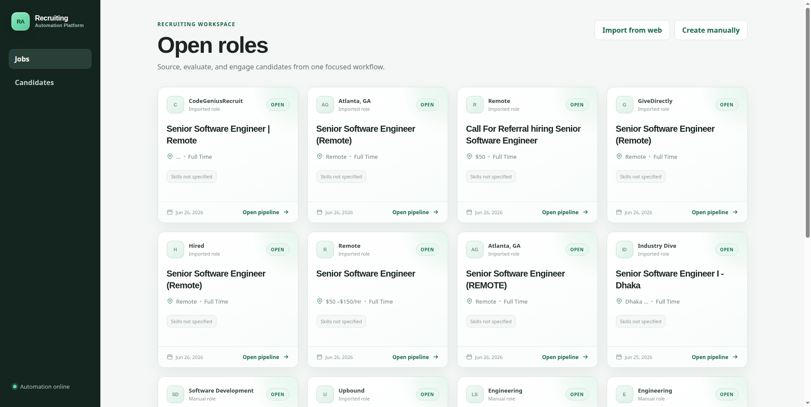

# Recruiting Automation Platform

A production-oriented recruiting workflow that helps teams import jobs, create jobs, source candidates, evaluate fit with AI, generate outreach, and track candidate responses.

Core workflow:

```text
Create or import job → source candidates → score fit → generate outreach → classify response
```

The repository is a TypeScript monorepo with:

- Express API
- React/Vite dashboard
- MongoDB persistence
- Redis caching and queue infrastructure
- BullMQ background worker
- Gemini AI integration
- Serper web search integration
- Swagger/OpenAPI documentation

## Dashboard preview



## Quick start

### Prerequisites

- Node.js 20+
- Docker with Docker Compose
- Gemini API key
- Serper API key

### Local setup

```bash
cp .env.example .env
npm install
npm run infra:up
npm run dev
```

Open:

- Dashboard: http://localhost:5173
- API: http://localhost:4000/api
- API health: http://localhost:4000/health
- Swagger documentation: http://localhost:4000/api/docs
- Raw OpenAPI document: http://localhost:4000/api/docs.json

The `dev` command starts the API, worker, and React UI together. The API receives requests and queues work; long-running sourcing and outreach jobs run in the separate worker process.

The development command uses Chokidar polling so it works reliably on Linux machines where editor/file watchers may already be consuming the inotify limit.

## Environment configuration

Set these values in `.env`:

```dotenv
AI_PROVIDER=gemini
GEMINI_API_KEY=your_gemini_key
GEMINI_MODEL=gemini-3.1-flash-lite

SOURCING_PROVIDER=serper
SERPER_API_KEY=your_serper_key

MONGODB_URI=mongodb://localhost:27017/recruiting_automation
REDIS_URL=redis://localhost:6379
WEB_ORIGIN=http://localhost:5173
API_PORT=4000
```

Keep API keys server-side only. Do not place Gemini or Serper keys in `apps/web`, `VITE_*` variables, or committed source files.

## Run with Docker

```bash
cp .env.example .env
docker compose up --build
```

## Repository structure

```text
.
├── apps
│   ├── api
│   │   ├── src
│   │   │   ├── docs        OpenAPI document
│   │   │   ├── lib         database, redis, logger, rate limits, retry helpers
│   │   │   ├── models      MongoDB schemas
│   │   │   ├── queues      BullMQ queue producers
│   │   │   ├── routes      Express routes
│   │   │   ├── services    Gemini, Serper, scoring, sourcing, normalization
│   │   │   ├── server.ts   HTTP process
│   │   │   └── worker.ts   background worker process
│   │   └── tests
│   └── web
│       └── src             React dashboard
├── docker-compose.yml
└── package.json            npm workspaces
```

## Architecture

```text
React dashboard
      │ HTTP
      ▼
Express API ─────────────── MongoDB
      │                       jobs, candidates, tasks,
      │ enqueue               scores, messages, responses
      ▼
Redis / BullMQ ◄────────── Redis score cache
      │
      ▼
Worker process
      ├── Serper job and candidate search
      └── Gemini scoring, outreach, and intent classification
```

The API and worker are separate runtime units. This keeps HTTP requests responsive while candidate sourcing and outreach generation happen asynchronously.

## Feature guide

### 1. Job management

The dashboard supports two ways to create roles:

- **Create manually**: enter title, department, location, employment type, description, requirements, and skills.
- **Import from web**: search public job listings through Serper and import selected roles into the workspace.

Manual jobs can be edited, updated, opened/closed, and deleted. Delete actions use an in-app confirmation modal and clean up job-specific scores, outreach messages, tasks, and candidate associations.

Imported jobs are deduplicated by normalized source URL, so importing the same public listing again returns the existing job instead of creating a duplicate.

### 2. Multi-job import

The import page lets you import multiple jobs from the same search results page. After each import:

- the page stays on the search results;
- the imported row is marked as imported;
- a “View role” link appears for that imported job;
- a floating toast confirms the action;
- duplicate import attempts show a clean toast message.

### 3. Candidate sourcing

From a job details page, “Source candidates” queues a background sourcing task. The worker searches public LinkedIn profile results through Serper, normalizes profile URLs, and deduplicates candidates globally.

Candidate sourcing includes:

- progress tracking from queued to completed;
- automatic candidate list refresh when sourcing finishes;
- a polished progress banner that reaches 100% before fading out;
- a “No matching candidates found” notice when Serper returns no usable profiles;
- broader fallback search queries for manually created jobs.

### 4. Candidate database

Candidates are stored globally and associated with one or more jobs. This prevents duplicate candidate records when the same profile appears in multiple sourcing runs.

Each candidate can include:

- name;
- headline;
- location;
- LinkedIn URL;
- profile summary;
- skills;
- estimated experience;
- status;
- related jobs;
- scores;
- outreach messages;
- response history.

### 5. AI candidate scoring

Gemini scores a candidate against a selected job and returns:

- numeric match score;
- recommendation;
- reasoning;
- strengths;
- gaps.

The UI shows only useful recruiter-facing information, such as:

```text
Scored 85/100
```

Internal cache details are intentionally hidden from the dashboard.

### 6. Score caching

Candidate scoring uses Redis cache-aside caching because scoring is the most repeatable AI operation.

The cache key is based on:

- candidate facts;
- job facts;
- provider;
- model;
- prompt hash.

If the job, candidate, provider, or model changes, the hash changes and a fresh score is generated. MongoDB remains the system of record; Redis is used only as a fast cache.

### 7. Outreach generation

The candidate details page can trigger AI-generated outreach for a selected job. The API returns immediately, while the worker generates and stores the outreach message.

Outreach messages follow the lifecycle `pending → sent → failed`, so recruiters can see when a message is being generated, when it has completed, or when it needs attention.

The UI behavior is recruiter-friendly:

- clicking “Trigger outreach” shows `Outreach triggered`;
- no internal task or queue ID is shown;
- the page polls the outreach task automatically;
- the message list refreshes as soon as generation completes;
- failures appear as clean toast notifications.

### 8. Candidate response classification

Recruiters can simulate or record candidate replies. Gemini classifies the response intent and stores the result.

Response classification supports:

- interested / not interested style intent tracking;
- response history;
- generated interview link when the candidate is interested;
- a toast action to open the interview link immediately;
- persistent response records on the candidate profile.

### 9. Professional dashboard UI

The React dashboard includes:

- professional sidebar branding with RA logo;
- job cards with status, metadata, skills, and pipeline links;
- polished manual job editor;
- public job search loader;
- floating toasts for async feedback;
- confirmation modals for destructive actions;
- score badges with visual match indicators;
- candidate tables;
- response history cards;
- mobile-friendly layouts.

The frontend uses Tailwind CSS utilities alongside project-specific CSS for custom components and animations.

### 10. API documentation

Swagger documentation is available at:

```text
http://localhost:4000/api/docs
```

The raw OpenAPI document is available at:

```text
http://localhost:4000/api/docs.json
```

The API startup logs print both the API link and documentation link.

### 11. Cleaner local logs

Development logs are message-only so the terminal remains readable:

```text
MongoDB connected
Background workers started
API live at: http://localhost:4000/api
API documentation live at: http://localhost:4000/api/docs
```

Structured JSON logging remains suitable for production environments.

### 12. Rate limits and provider failure handling

The API protects both local infrastructure and external providers.

Inbound limits are Redis-backed and include:

- general API traffic;
- mutating requests;
- AI-heavy endpoints;
- external job search.

Provider handling includes:

- graceful Gemini retry for transient overload and retryable rate limits;
- Serper rate-limit handling with retry delay support;
- `Retry-After` headers for controlled client retries;
- clean error envelopes instead of server crashes.

## Background jobs

These actions run asynchronously:

- candidate sourcing;
- outreach generation.

The API creates a durable task record and adds a BullMQ job. The worker updates the task through:

```text
queued → active → completed
queued → active → failed
```

The UI polls task state and refreshes affected data when tasks finish.

Worker behavior:

- bounded concurrency;
- queue-level rate limiting;
- exponential retry behavior;
- persisted task progress;
- persisted terminal errors;
- separate process from the API.

## Data model

### Job

Stores role details, status, skills, requirements, and optional source metadata for imported roles.

### Candidate

Stores global candidate profiles and associates each candidate with multiple jobs through `jobIds`.

### AutomationTask

Stores API-visible background job state, progress, result, and errors.

### CandidateScore

Stores job-specific AI score results and the evidence behind the recommendation.

### OutreachMessage

Stores generated outreach content and delivery state.

### CandidateResponse

Stores candidate replies, AI-classified intent, reasoning, confidence, and optional scheduling link.

## API endpoints

All successful responses use:

```json
{
  "success": true,
  "data": {}
}
```

Errors use:

```json
{
  "success": false,
  "error": {
    "message": "Error message"
  }
}
```

| Method | Endpoint | Purpose |
|---|---|---|
| `POST` | `/api/jobs` | Create a manual job |
| `GET` | `/api/jobs` | List jobs |
| `GET` | `/api/jobs/external/search` | Search public job listings through Serper |
| `POST` | `/api/jobs/import-external` | Import a public listing as a job |
| `GET` | `/api/jobs/:id` | Get job details |
| `PATCH` | `/api/jobs/:id` | Update a manually created job |
| `DELETE` | `/api/jobs/:id` | Delete a manual job and related job-specific data |
| `POST` | `/api/jobs/:jobId/sourcing-tasks` | Queue candidate sourcing |
| `GET` | `/api/jobs/:jobId/candidates` | List candidates for a job |
| `GET` | `/api/tasks/:taskId` | Read background task state |
| `GET` | `/api/candidates` | List globally deduplicated candidates |
| `GET` | `/api/candidates/:id` | Get candidate details, jobs, scores, messages, and responses |
| `POST` | `/api/candidates/:id/scores` | Score a candidate against a job |
| `POST` | `/api/candidates/:id/outreach` | Queue AI outreach generation |
| `POST` | `/api/candidates/:id/responses` | Classify a candidate response |

## Example API request

Create a manual job:

```bash
curl -X POST http://localhost:4000/api/jobs \
  -H 'Content-Type: application/json' \
  -d '{
    "title": "Lead MERN Engineer",
    "department": "Engineering",
    "location": "Remote",
    "employmentType": "full-time",
    "description": "Lead a team building reliable recruiting automation services.",
    "requirements": ["7+ years software engineering", "Technical leadership"],
    "skills": ["Node.js", "TypeScript", "React", "MongoDB", "Redis"]
  }'
```

## Quality checks

```bash
npm run typecheck
npm test
npm run build
```

The test suite covers provider normalization, URL deduplication, scoring behavior, sourcing behavior, and response classification behavior.

## Deployment notes

For production deployment, run these as separate units:

- API process
- worker process
- web app
- MongoDB
- Redis

Recommended production additions:

- authentication and organization-level access control;
- tenant-scoped database queries;
- managed secret storage;
- encrypted sensitive candidate fields;
- audit logs;
- provider cost telemetry;
- queue dashboards;
- distributed tracing and metrics;
- pagination and cursor-based list APIs;
- human review controls before high-volume outreach.
